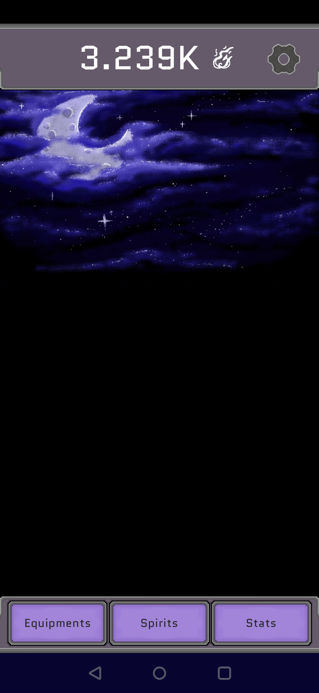
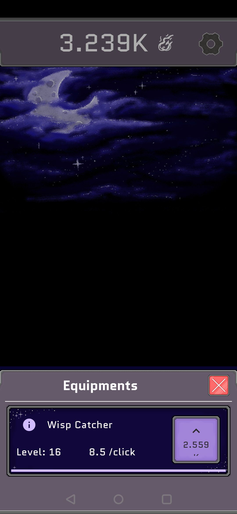
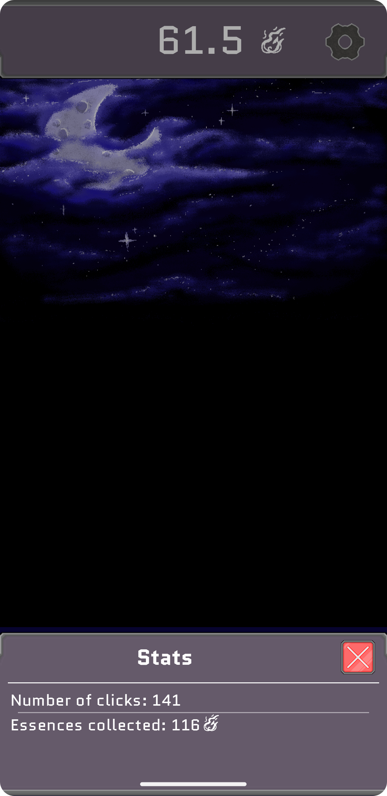
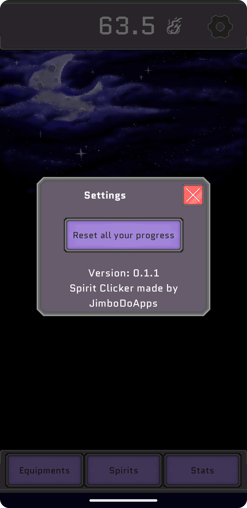

# :sparkles: Spirit Clicker

This project is a learning experience for me to explore Kotlin, Compose and Git. Spirit Clicker is a game inspired by the infamous Cookie Clicker we all knew on browsers (also available on mobile now). The goal for me is to be able to learn Kotlin while coding and to present the project to a possible mentor or company.

               

## :warning: Requirements
You'll need an Android device or emulator with API 31+ (Android 12+)

## :key: Features
### Main game
- Click on the screen to earn essences
- Level up your main equipment to earn even more
### Game stats
- How many times you clicked on your screen
- How many essences you gathered
### Settings
- Reset all the data to restart the game

## :cd: Installation
Go to the repository [release](https://github.com/JimboDoApps/SpiritClicker/releases) section to download the latest version .APK file and install it on your device.

On the latest versions of Android, a popup will appear to confirm the installation of an external and unknown .APK (with a button linked to the option to accept those installs).

If you are on an older version of Android be sure to have the developpers options activated on your device and the right to install external APKs unless Android will stop you from installing the app.

## License

[GNU v3.0](https://choosealicense.com/licenses/gpl-3.0/)